# 第 1 章 Netty - 异步和事件驱动

## 1.1 Java 网络编程

阻塞 I/O 的影响：
* 在任何时候都可能有大量的线程处于休眠状态，只是等待输入或输出数据就绪，这可能算是一种资源浪费。
* 需要为每个线程的调用栈都分配内存，其默认值大小区间是 64 KB 到 1 MB，具体取决于操作系统。
* 即使 JVM 在物理上可以支持非常大数量的线程，但是远在到达极限之前，上下文切换所带来的开销就会很麻烦。

图 1-1 使用阻塞 I/O 处理多个连接

### 1.1.2 选择器

选择器使用了事件通知 API 以确定在一组非阻塞套接字中有哪些已经就绪能够进行 I/O 相关操作。因为可以在任何时候检查任意读写操作的完成状态，所以如图 1-2 所示，一个单一的线程就可以处理多个并发的连接。

图 1-2 使用 Selector 的非阻塞 I/O

## 1.3 Netty 的核心组件

Netty 的核心组件包括：Channel、回调、Future、事件和 ChannelHandler。

### 1.3.1 Channel

Channel 代表一个实体（如一个硬件设备、一个文件、一个网络套接字或一个能够执行一个或多个不同的 I/O 操作的程序组件）的开放连接，如读操作和写操作。目前可以把 Channel 看作是传入（入站）或传出（出站）数据的载体。因此，它可以被打开或关闭，连接或断开连接。

### 1.3.2 回调

一个回调其实就是一个方法，一个指向已经被提供给另外一个方法的方法的引用。

### 1.3.3 Future

Future 提供了另一种在操作完成时通知应用程序的方式。这个对象可以看作是一个异步操作结果的占位符。它将在未来的某个时刻完成，并提供对其结果的访问。

JDK 预置的 Future 实现只允许通过手动检查对应的操作是否已经完成，或者一直阻塞直到它完成，非常繁琐，所以 Netty 提供了它自己的实现 - ChannelFuture，用于在执行异步操作时使用。

ChannelFuture 提供了几种额外的方法，这些方法使得我们能够注册一个或多个 ChannelFutureListener 实例。监听器的回调方法 operationComplete()，将会在对应的操作完成时被调用，如果 ChannelFutureListener 添加到 ChannelFuture 时，ChannelFuture 已经完成，那么该 ChannelFutureListener 将会被直接通知。

每个 Netty 的出站 I/O 操作都将返回一个 ChannelFuture，它们都不会被阻塞，Netty 是完全异步和事件驱动的。