# 第 3 章 Netty 的组件和设计

## 3.1 Channel、EventLoop 和 ChannelFuture

### 3.1.1 Channel 接口

基本的 I/O 操作（bind()、connect()、read() 和 write()）依赖于底层网络传输所提供的原语。在基于 Java 的网络编程中，其基本的构造是 Socket 类。Netty 的 Channel 接口所提供的 API，大大降低了直接使用 Socket 类的复杂性。

### 3.1.2 EventLoop 接口

EventLoop 定义了 Netty 的核心抽象，用于处理连接的生命周期中所发生的事件。图 3-1 在高层次上说明了 Channel、EventLoop、Thread 和 EventLoopGroup 之间的关系。这些关系是：
* 一个 EventLoopGroup 包含一个或多个 EventLoop；
* 一个 EventLoop 在它的生命周期内只和一个 Thread 绑定；
* 所有由 EventLoop 处理的 I/O 事件都将在它专有的 Thread 上被处理；
* 一个 Channel 在它的生命周期内只注册于一个 EventLoop；
* 一个 EventLoop 可能会被分配给一个或多个 Channel。

在这种设计中，一个给定 Channel 的 I/O 操作都是由相同的 Thread 执行的，实际上消除了对于同步的需要。

图 3-1 Channel、EventLoop 和 EventLoopGroup

### 3.1.3 ChannelFuture 接口

Netty 中的所有 I/O 操作都是异步的，因为一个操作可能不会立即返回，所以需要一种需要在之后的某个时间点确定其结果的方法。为此，Netty 提供了 ChannelFuture 接口，其 addListener() 方法注册了一个 ChannelFutureListener，以便在某个操作完成时（无论是否成功）得到通知。此外，所有属于同一个 Channel 的操作都被保证其将以它们被调用的顺序被执行。

## 3.2 ChannelHandler 和 ChannelPipeline

### 3.2.1 ChannelHandler 接口

ChannelHandler 充当了所有处理入站和出站数据的应用程序逻辑的容器，事实上，ChannelHandler 可专门用于几乎任何类型的动作，例如将数据从一种格式转换为另一种格式或者处理转换过程中所抛出的异常。

### 3.2.2 ChannelPipeline 接口

ChannelPipeline 提供了 ChannelHandler 链的容器，并定义了用于在该链上传播入站和出站事件流的 API，当 Channel 被创建时，它会被自动地分配到它专属的 ChannelPipeline。ChannelHandler 安装到 ChannelPipeline 的过程如下：
* 一个 ChannelInitializer 的实现被注册到了 ServerBootstrap 中；
* 当 ChannelInitializer.initChannel() 方法被调用时，ChannelInitializer 将在 ChannelPipeline 中安装一组自定义的 ChannelHandler；
* ChannelInitializer 将它自己从 ChannelPipeline 中移除。

**关于入站和出站 ChannelHandler 的更多讨论**

通过使用作为参数传递到每个方法的 ChannelHandlerContext，事件可以被传递给 ChannelHandler 链中的下一个 ChannelHandler。因为有时会忽略那些不感兴趣的事件，所以 Netty 提供了抽象基类 ChannelInboundHandlerAdapter 和 ChannelOutboundHandlerAdapter。通过调用 ChannelHandlerContext 上的对应方法，每个都提供了简单地将事件传递给下一个 ChannelHandler 方法的实现。随后，可以通过重写感兴趣的那些方法来扩展这些类。

鉴于出站操作和入站操作是不同的，虽然 ChannelInboundHandler 和 ChannelOutboundHandler 都扩展自 ChannelHandler，但是 Netty 能区分 ChannelInboundHandler 实现和 ChannelOutboundHandler 实现，并确保数据只会在具有相同定向类型的两个 ChannelHandler 之间传递。

当 ChannelHandler 被添加到 ChannelPipeline 时，它将会被分配一个 ChannelHandlerContext，其代表了 ChannelHandler 和 ChannelPipeline 之间的绑定。虽然这个对象可以被用于获取底层的 Channel，但是它主要还是被用于写出站数据。

在 Netty 中，有两种发送消息的方式。可以直接写到 Channel 中，也可以写到和 ChannelHandler 相关联的 ChannelHandlerContext 对象中，前一种方式将会导致消息从 ChannelPipeline 的尾端开始流动，而后者将导致消息从 ChannelPipeline 中的下一个 ChannelHandler 开始流动。

### 3.2.4 编码器和解码器

当通过 Netty 发送或接收一个消息时，将会发生一次数据转换。入站消息会被解码，即从字节转换为另一种格式，通常是一个 Java 对象。如果是出站消息，则会发生相反方向的转换：它将从它的当前格式被转换为字节。这两种方向转换的原因很简单：网络数据总是一系列的字节。

所有由 Netty 提供的编码器/解码器适配器类都实现了 ChannelInboundHandler 或 ChannelOutboundHandler 接口。

对于入站数据来说，channelRead 方法已经被重写了。对于每个从入站 Channel 读取的消息，这个方法都会被调用。随后，它将调用由预置解码器所提供的 decode() 方法，并将已解码字节转发给 ChannelPipeline 中的下一个 ChannelInboundHandler。出站消息的模式是相反方向的：编码器将消息转换为字节，并将它们转发给下一个 ChannelOutboundHandler。

## 3.3 引导

Netty 的引导类为应用程序的网络层配置提供了容器，这涉及将一个进程绑定到某个指定的端口（引导服务器），或者将一个进程连接到另一个运行在某个指定主机的指定端口的进程（引导客户端）。无论应用程序使用哪种协议或者处理哪种类型的数据，唯一决定它使用哪种引导类的是它是作为一个客户端还是一个服务器。引导一个客户端只需要一个 EventLoopGroup，但是引导一个服务器则需要两个（也可以是同一个实例，此时其将在两个场景下共用同一个 EventLoopGroup）。

因为服务器需要两组不同的 Channel。第一组只包含一个 ServerChannel，代表服务器自身已绑定到某个本地端口的正在监听的套接字。而第二组将包含所有已创建的用来处理传入客户端连接（对于每个服务器已经接受的连接都有一个）的 Channel。图 3-4 说明了这个模型，并且展示了为何需要两个不同的 EventLoopGroup。与 ServerChannel 相关联的 EventLoopGroup 将分配一个负责为传入连接请求创建 Channel 的 EventLoop。一旦连接被接受，第二个 EventLoopGroup 就会给它的 Channel 分配一个 EventLoop。

图 3-4 具有两个 EventLoopGroup 的服务器

