# 第 11 章 预置的 ChannelHandler 和编解码器

## 11.1 通过 SSL/TLS 保护 Netty 应用程序

Netty 支持 OpenSSL 和 JDK 提供的 SSL 实现。

在大多数情况下，SslHandler 将是 ChannelPipeline 中的第一个 ChannelHandler，这确保了只有在所有其他的 ChannelHandler 将它们的逻辑应用到数据后才会进行加密。

## 11.2 构建基于 Netty 的 HTTP/HTTPS 应用程序

### 11.2.1 HTTP 解码器、编码器和编解码器

图 11-2 HTTP 请求的组成部分

图 11-3 HTTP 响应的组成部分

如图 11-2 和 11-3 所示，一个 HTTP 请求/响应可能由多个数据部分组成，并且它总是以一个 LastHttpContent 部分作为结束。FullHttpRequest 和 FullHttpResponse 消息是特殊的子类型，分别代表了完整的请求和响应。所有类型的 HTTP 消息都实现了 HttpObject 接口。 

### 11.2.2 聚合 HTTP 消息

由于 HTTP 的请求和响应可能由许多部分组成，因此需要聚合它们以形成完整的消息。为了消除这项繁琐的任务，Netty 提供了一个聚合器，它可以将多个消息部分合并为 FullHttpRequest 或 FullHttpResponse。通过这种方式，将总是看到完整的消息内容。由于消息分段需要被缓冲，直到可以转发一个完整的消息给下一个 ChannelInboundHandler，所以这个操作由轻微的开销，其所带来的好处是不必关心消息碎片了。引入这种自动聚合机制可需要向 ChannelPipeline 中添加另外一个 ChannelHandler。

### 11.2.3 HTTP 压缩

当使用 HTTP 时，建议开启压缩功能以尽可能多地减小传输数据的大小。虽然压缩会带来一些 CPU 时钟周期上的开销，但是通常来说它都是一个好注意，特别是对于文本数据来说。Netty 为压缩和解压缩提供了 ChannelHandler 实现，它们同时支持 gzip 和 deflate 编码。需要注意的是，服务器没有义务压缩它所发送的数据。

### 11.2.4 使用 HTTPS

启用 HTTPS 只需要将 SslHandler 添加到 ChannelPipeline 的 ChannelHandler 组合中。

## 11.3 空闲的连接和超时

检测空闲连接以及超时对于及时释放资源来说至关重要，由于这是一项常见的任务，Netty 特地为它提供了几个 ChannelHandler 实现。表 11-4 给出了它们的概述。

表 11-4 用于空闲连接以及超时的 ChannelHandler

| 名称                  | 描述                                                                                                                                                                         |
| :-------------------- |:---------------------------------------------------------------------------------------------------------------------------------------------------------------------------|
| IdleStateHandler      | 当连接空闲时间太长时，将会触发一个 IdleStateEvent 事件。然后，可以通过在 ChannelInboundHandler 中重写 userEventTriggered() 方法来处理该 IdleStateEvent 事件                        |
| ReadTimeoutHandler    | 如果在指定的时间间隔内没有收到任何的入站数据，则抛出一个 ReadTimeoutException 并关闭对应的 Channel。可以通过重写 ChannelHandler 中的 exceptionCaught() 方法来检测该 ReadTimeoutException                                    |
| WriteTimeoutHandler   | 如果在指定的时间间隔内没有收到任何的入站数据，则抛出一个 WriteTimeoutException 并关闭对应的 Channel。可以通过重写 ChannelHandler 中的 exceptionCaught() 方法来检测该 WriteTimeoutException                                  |

## 11.4 解码基于分隔符的协议和基于长度的协议

### 11.4.1 基于分隔符的协议

基于分隔符的消息协议使用定义的字符来标记消息或消息段（通常称为帧）的开头或结尾，由 RFC 文档正式定义的许多协议（如 SMTP、POP3、IMAP 以及 Telnet）都是这样的。此外，私有组织通常也拥有他们自己的专有格式。无论使用什么协议，表 11-5 中列出的解码器都能提取由任意标记序列分隔的帧。

表 11-5 用于处理基于分隔符的协议的解码器

| 名称                       | 描述                                                                                       |
| :------------------------- |:-----------------------------------------------------------------------------------------|
| DelimiterBasedFrameDecoder | 使用任何由用户提供的分隔符来提取帧的通用解码器                                                                  |
| LineBasedFrameDecoder      | 提取由行尾符（\n 或者 \r\n） 分隔的帧的解码器，这个解码器比 DelimiterBasedFrameDecoder 更快                         |

### 11.4.2 基于长度的协议

基于长度的协议通过将它的长度编码到帧的头部来定义帧（对于固定帧大小的协议来说，不需要将帧长度编码到头部），表 11-6 列出了 Netty 提供的用于处理基于长度的协议的解码器。

表 11-6 用于处理基于长度的协议的解码器

| 名称                           | 描述                                                                                                             |
| :----------------------------- | :---------------------------------------------------------                                                       |
| FixedLengthFrameDecoder        | 提取在调用构造函数时指定的定长帧                                                                                 |
| LengthFieldBasedFrameDecoder   | 根据编码进帧头部中的长度值提取帧（提取的帧包括了实际内容，但不包含头部）；该字段的偏移量以及长度在构造函数中指定 |

